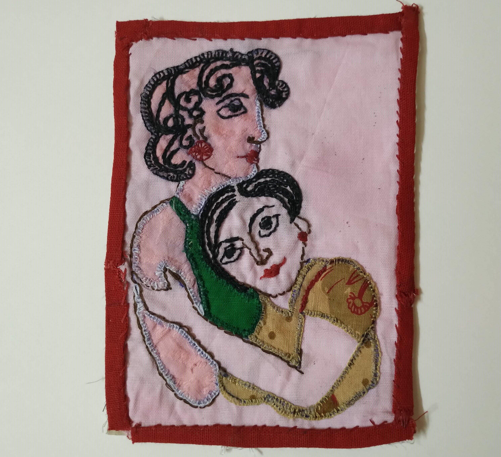

>What do dogs do on their day off?; Can't lie around – that's their job!

- George Carlin

I have recently started blogging, and I wrote my first technical article (aimed more towards entertainment than elightenment) on Quantum Supremacy [here](https://medium.com/@purnatag/quantum-supremacy-for-noobs-like-me-afaf9a43d5e7). 

In general, I have too many hobbies, none of which I am particularly great at. I find this a wonderful occurence that prevents me from being biased towards any one thing :P

However, very rarely, other people make good use of my pastimes to make beautiful things truly gorgeous. For example, Agents of Ishq, the quirky publication covering Sex Ed, Queerness and all things _"hawwww"_ in the Indian society, gave me a chance to illustrate [this](http://agentsofishq.com/memories-of-touch/) article.

I also make a stitch or two in time (not a good joke, I know, but I must preserve the nerd joke standards!).  

-----------------------------------------------------------------

A section on reading must start with a quote on the same.  

>“I find television very educating. Every time somebody turns on the set, I go into the other room and read a book.”  

? Groucho Marx

I have recently started loving podcasts, like [Harry Potter At Home](https://open.spotify.com/show/2JUljwaD9fNSeq8Vy3UAUp), audiobooks on Audible, and the text-to-speech android app @Voice Aloud Reader converting my ebooks into audiobooks. Find my Goodreads profile [here](https://www.goodreads.com/user/show/69306191-purnata-ghosal).

-----------------------------------------------------------------

Finally, a shameless plug of my social media accounts on [Instagram](https://www.instagram.com/thecyniccat/), [Twitter](https://twitter.com/gpurnata) and [Medium](https://medium.com/@purnatag).